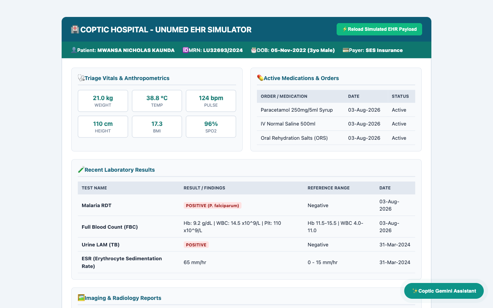
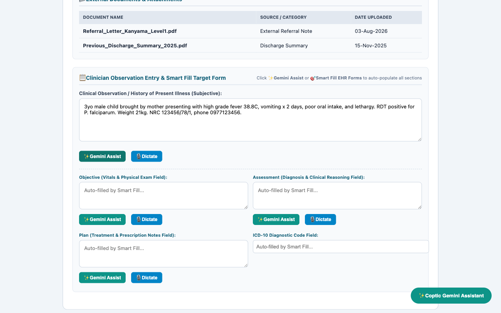
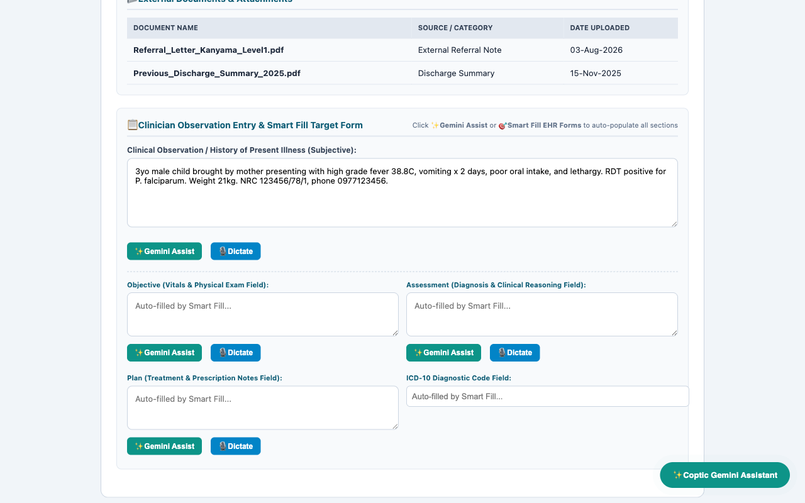

# 📸 Coptic Hospital - Gemini Assistant (v7.0) Visual Walkthrough

This document provides a high-definition 4-step visual walkthrough demonstrating the **Coptic Gemini Assistant** Chrome Extension operating inside the Unumed EHR environment.

---

## 📸 Step-by-Step Visual Walkthrough

### Step 1: 📖 Unumed EHR Patient Chart Interception
Automatically intercepts 5 categories of patient data (Demographics, Vitals, Labs, Imaging, Orders).

---

### Step 2: ✨ 1-Click AI SOAP Analysis & ICD-10 Coding
Clinicians click `✨ Gemini Assist` to generate Zambia STG compliant notes & pediatric dosing tiers.

---

### Step 3: 🎯 Multi-Field Smart Form Auto-Populator
Click `🎯 Smart Fill EHR Forms` to populate Subjective, Objective, Assessment, Plan, and ICD-10 fields across Unumed.

---

### Step 4: 🌟 Dynamic Floating Assistant FAB Widget
Persistent bottom-right button for 1-click access to saved patient analyses and follow-up Q&A chat.

---

## 📊 Summary Table

| Step # | Feature Name | Description & Key Functionality |
| :--- | :--- | :--- |
| **Step 1** | **📖 Chart & GraphQL Interception** | Automatically aggregates Demographics, Vitals, Labs, Imaging, and Medications. |
| **Step 2** | **✨ 1-Click AI Assistant** | Clinician clicks `✨ Gemini Assist` next to the observation box to generate Zambia STG SOAP notes. |
| **Step 3** | **🏷️ ICD-10 Diagnostic Chips** | Renders interactive ICD-10 code chips (`B50.9 Plasmodium falciparum malaria`). |
| **Step 4** | **🎯 Smart Fill Auto-Populator** | Auto-populates Subjective, Objective, Assessment, Plan, and ICD-10 form fields across the EHR page. |
| **Step 5** | **🌟 Floating Assistant FAB** | Displays persistent bottom-right assistant button with glowing context indicator (`🟢 Unumed Live`). |

---

## 🔗 Quick Repository Links
* **Repository Root**: [`https://github.com/amitry/coptic-gemini-extension`](https://github.com/amitry/coptic-gemini-extension)
* **Onsite Handover Guide**: [`ONSITE_HANDOVER_CHECKLIST.md`](https://github.com/amitry/coptic-gemini-extension/blob/main/ONSITE_HANDOVER_CHECKLIST.md)
* **CI/CD Credentials Guide**: [`CHROME_WEBSTORE_CI_SETUP.md`](https://github.com/amitry/coptic-gemini-extension/blob/main/CHROME_WEBSTORE_CI_SETUP.md)
